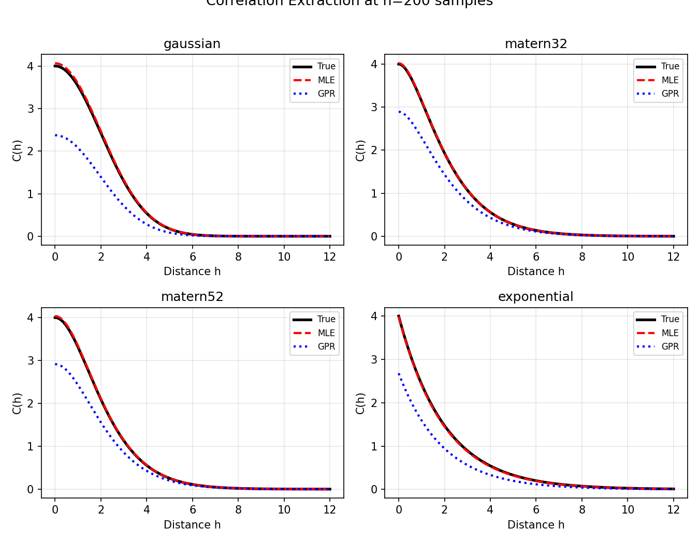
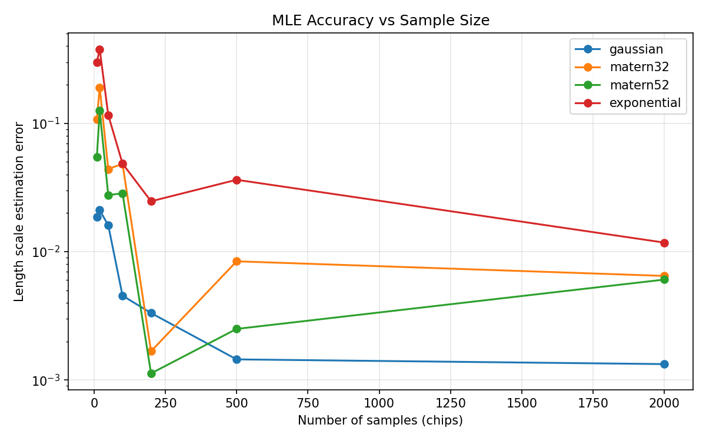
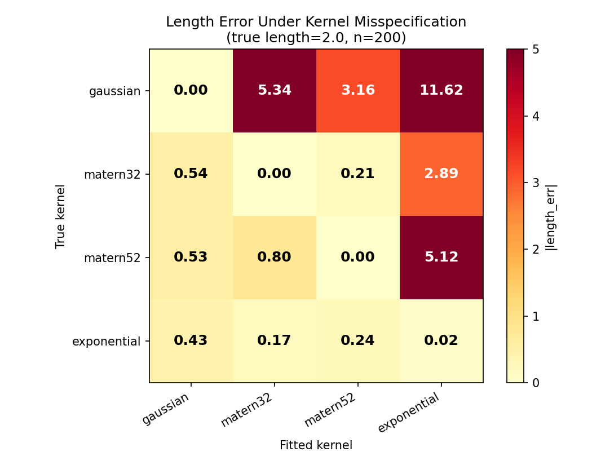
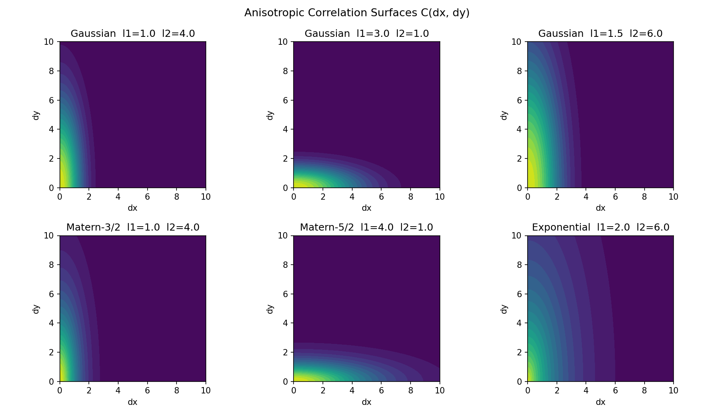

## Introduction {#sec:intro}

As semiconductor feature sizes continue to shrink, process variations become a
first-order determinant of circuit performance and yield. The traditional
corner-based methodology verifies timing at extreme process-voltage-temperature
corners, but intra-die variation has grown to dominate the total budget, so
corner analysis becomes increasingly pessimistic and expensive. On a
representative ten-inverter chain, enforcing timing closure at the worst-case
corner required roughly $54\%$ more area and $44\%$ more power than a
statistical design that predicts delay at $\mu + 3\sigma$ [@champac2018timing].
Statistical design instead models the process parameters as random variables
and propagates their distributions to path delay.

A key ingredient of statistical timing is the spatial correlation of the
underlying process parameters. Two devices that are physically close tend to
vary together, whereas distant devices are almost independent, and for long
paths these correlations dominate the path delay variance. The correlation
structure is obtained from measurements on dedicated test chips and is then
described by a correlation function of the separation distance. The model must
be positive definite, since a covariance matrix built from a non-positive-definite
kernel is not a valid covariance matrix.

Two modeling philosophies compete. Parametric kernels---exponential, Gaussian
and Matérn---are parameterized by a length scale and are positive definite by
construction [@matern1986spatial; @rasmussen2006gaussian], but they presuppose
the shape of the correlation function, and their likelihood is non-convex in the
parameters. When that shape is not known---as is the case for a new process,
whose correlation may even be non-monotone---the presupposition is the obstacle,
and a non-parametric approach is the appropriate choice: polynomial and B-spline
expansions of the kernel commit to no particular shape, at the cost of a
constrained fit and a separate mechanism to enforce positive definiteness.

This paper develops a non-parametric framework and, within it, identifies and
fixes a subtle but critical detail: the initialization of the optimization. Our
contributions are as follows.

1. We formulate the extraction as a basis expansion of the covariance matrix and
   fit it with a cutting-plane method, comparing LSQ and MLE objectives
   (@sec:problem).
2. We analyze the convexity of the MLE objective and show it is a difference of
   convex functions, hence not globally convex (@sec:convexity).
3. We solve the MLE with the convex-concave procedure (CCP), whose fixed points
   are stationary points of the true objective (@sec:ccp).
4. We propose a robust initialization for the CCP that replaces the singular-prone
   least-squares warm start with a guaranteed positive-definite precision
   obtained from the free MLE and a nearest-positive-definite repair
   (@sec:init).
5. We validate the approach on polynomial and clamped B-spline bases, on
   isotropic and anisotropic data, over a range of sample sizes, and across
   Python, C++ and Rust implementations (@sec:experiments).

## Related Work {#sec:related}

Spatial correlation modeling from silicon measurement data aims to extract the
characteristic parameters of a correlation function from a large amount of test
data, and it raises two questions: which functional form to use, and how to
estimate its parameters [@friedberg2005; @doh2005; @xiong2007; @liu2007;
@hargreaves2008; @fu2008spectral]. An early approach fitted an exponential
correlation with a curve-fitting procedure [@liu2007]; a least-squares method
recovered the parameters of the Matérn function from data distorted by white
noise [@xiong2007]; and a spectral-domain method exploited the Fourier
counterpart of the Matérn function to suppress high-frequency measurement error
[@fu2008spectral]. A maximum-likelihood method for a *single* test chip was
proposed in [@hargreaves2008], but it yields one parameter set per chip with no
criterion for choosing among them, and it ignores the purely random component
and the measurement error. The multi-chip MLE-M method of @sec:problem
addresses all three issues.

The estimated correlation feeds variation-aware design: statistical timing
analysis [@chang2005; @zhang2006; @orshansky2002], power and leakage
minimization [@bhardwaj2006; @heloue2007], and the statistical design
methodology that replaces pessimistic corner analysis [@nassif2000; @nassif2001;
@pitchumani2005; @champac2018timing]. The underlying random-field and
geostatistical theory is classical [@matern1986spatial; @stein1999interpolation;
@cressie1993statistics; @diggle2007; @schabenberger2005; @banerjee2004;
@vanmarcke1983; @gihman1974], as are the maximum-likelihood foundations
[@anderson2003; @myung2003] and the numerical optimizers used to fit them
[@byrd1995limited; @coleman1996].

## Background {#sec:background}

### Process Variation and Spatial Correlation

A process parameter $X$, such as the effective channel length or the threshold
voltage, is modeled as a normal random variable. Its deviation decomposes into
an inter-die (die-to-die) component, a spatially correlated intra-die component,
and a purely random intra-die component,
$$
X = \mu_X + X_{D2D} + X_{WID,c} + X_{WID,r},
$$
and, because the components are independent, the variances add:
$$
\sigma_X^2 = \sigma_{X_{D2D}}^2 + \sigma_{X_{WID,c}}^2 + \sigma_{X_{WID,r}}^2 .
$$ {#eq:vardecomp}

Following the conventional decomposition [@pitchumani2005], the intra-die part
is often refined further into a *deterministic* component, fixed by the layout
context and modelable by deliberately exploring layout patterns; a *correlated
random* component, random but spatially correlated through proximity effects;
and a *purely random* component, which is spatially uncorrelated. We assume the
deterministic part to be modeled and removed, and concentrate on the correlated
component together with the purely random component and the measurement error
[@xiong2007; @fu2008spectral]. The purely random component and the measurement
error produce the nugget effect described below.

The correlation between two gates $i$ and $j$ separated by a distance $d_{ij}$
is often written in the exponential form
$$
\rho(X_i, X_j) = K_{D2D} + K_{WID} \exp\!\left(-\frac{d_{ij}}{CD_{WID}}\right),
$$ {#eq:expcorr}
where $K_{D2D}$ is the inter-die fraction, $K_{WID}$ the correlated intra-die
fraction and $CD_{WID}$ the correlation distance [@champac2018timing]. For a path
of $N$ gates, the path delay variance is the sum of the gate variances plus the
pairwise covariances,
$$
\sigma_{DP}^2 = \sum_{i=1}^{N} \sigma_{D_i}^2
             + 2 \sum_{i=1}^{N} \sum_{j=i+1}^{N} \operatorname{Cov}(D_i, D_j),
$$ {#eq:pathvar}
and only spatially correlated parameters contribute to the covariance terms.
Consequently, correlation dominates the path delay variance as the logic depth
grows, which motivates an accurate spatial correlation model.

### Random Fields and Correlation Functions

A spatially varying quantity is described by a random field
$\{\tilde{z}(s) : s \in D\}$, and its second-order structure is captured by the
covariance $C(s_i, s_j) = \operatorname{cov}(\tilde{z}(s_i), \tilde{z}(s_j))$
and the correlation
$$
R(s_i, s_j) = \frac{C(s_i, s_j)}{\sqrt{C(s_i, s_i)\, C(s_j, s_j)}} .
$$
Under the homogeneous and isotropic assumption (HIF), both depend only on the
separation $h = \lVert s_i - s_j \rVert$, so that
$C(h) = \sigma^2 \rho(h)$. A valid covariance function must be positive definite:
for all sites $s_1, \dots, s_n$ and all coefficients $a_1, \dots, a_n$,
$\sum_i \sum_j a_i a_j C(s_i, s_j) \ge 0$, with equality only when all $a_i = 0$.
Equivalently, by Bochner's theorem, its Fourier transform is a non-negative
measure.

### Parametric and Non-Parametric Models

Common parametric kernels are the exponential
$\rho(h) = \exp(-\alpha h)$, the Gaussian
$\rho(h) = \exp(-\alpha h^2)$, and the Matérn family
$$
\rho(h) = \frac{(\alpha h)^{\nu}}{2^{\nu-1}\Gamma(\nu)} K_{\nu}(\alpha h),
$$ {#eq:matern}
where $K_{\nu}$ is the modified Bessel function of the second kind and $\Gamma$
is the gamma function [@matern1986spatial]. The Matérn family interpolates
between the exponential ($\nu = 1/2$) and the Gaussian (as $\nu \to \infty$),
so it spans a spectrum of smoothness. These kernels are guaranteed positive
definite, but estimation is non-convex, the shape is presupposed, and the
isotropic assumption may be violated. When the shape of the correlation function
is unknown, a non-parametric basis---polynomials or B-splines---avoids the
presupposition and can represent non-monotone correlation, at the cost of a
constrained, higher-dimensional fit that does not by itself guarantee positive
definiteness.

### The Nugget Effect and the Modified Matérn Function

Apart from the spatially correlated component, the purely random component of
intra-die variation and the unavoidable measurement error also contribute. Both
are modeled as Gaussian white noise with a combined variance $\tau^2$, and they
introduce a discontinuity at the origin of the correlation function known as the
*nugget effect* [@diggle2007; @schabenberger2005]. Writing the variance of the
correlated component as $\sigma^2$, the modified Matérn correlation function is
$$
\tilde{R}(h) =
\begin{cases}
1, & h = 0, \\[4pt]
\dfrac{\sigma^2}{\sigma^2 + \tau^2}\, R(h), & h > 0,
\end{cases}
$$ {#eq:nugget}
where $R(h)$ is the Matérn function @eq:matern. The ratio
$\kappa = \tau^2 / \sigma^2$ measures the noise-to-signal variance, and the
modified correlation matrix of the measurements becomes
$\tilde{R}(\kappa, \psi) = R(\psi) + \kappa I$ [@xiong2007; @hargreaves2008].
Ignoring the nugget in the extraction severely distorts the recovered
correlation function, as the experiments of @sec:experiments show.

### Gaussian Process Regression

A Gaussian process is a collection of random variables whose every finite
subset is multivariate normal,
$f(\mathbf{x}) \sim \mathcal{GP}(m(\mathbf{x}), k(\mathbf{x}, \mathbf{x}'))$.
For a zero-mean process the kernel $k$ *is* the spatial correlation function, so
fitting a Gaussian process and extracting the correlation are the same problem
[@rasmussen2006gaussian]. The hyperparameters are commonly estimated by
minimizing the negative log marginal likelihood with L-BFGS-B and multiple
random restarts to mitigate local minima [@byrd1995limited]. A Gaussian process
trained on a single realization, however, uses only one chip of measurements and
is correspondingly noisier than a covariance-based estimator that pools all
chips.

## Problem Formulation {#sec:problem}

### Biased Sample Covariance

Let $z_m(s_i)$ denote the measurement at site $s_i$ on chip $m$, for
$m = 1, \dots, M$ and $i = 1, \dots, n$. Removing the across-chip mean at each
site gives the centered data $y_m(s_i)$, and the biased sample covariance is
$$
Y = \frac{1}{M} \sum_{m=1}^{M} y_m y_m^{\top} .
$$ {#eq:y}
When the number of chips is at least the number of sites ($M \ge n$) and the
data are sufficiently rich, $Y$ is positive definite; when $M < n$, $Y$ is
rank-deficient and singular. This is the statistical reason that "more samples
is easier": the sample covariance approaches the true covariance as $M$ grows,
and the estimation problem becomes better conditioned.

### Basis Expansion

We write the correlation function as a linear combination of basis functions,
$\rho(h) = \sum_i p_i \Psi_i(h)$, and form the covariance matrix
$$
\Omega(p) = \sum_{k=1}^{m} p_k F_k, \qquad (F_k)_{ij} = \Psi_k(\lVert s_i - s_j \rVert),
$$ {#eq:omega}
which is affine in the coefficients $p$. The difficulty is that the MLE
objective contains $\Omega(p)^{-1}$, and the inverse of a matrix cannot be
expressed in convex form.

### Least-Squares Estimation

The least-squares (LSQ) estimate minimizes the Frobenius residual to the sample
covariance,
$$
\min_{p,\, \kappa} \; \lVert \Omega(p) + \kappa I - Y \rVert_F
\quad \text{s.t.} \quad \Omega(p) \succeq 0, \; \kappa \ge 0,
$$ {#eq:lsq}
a convex problem whose nugget $\kappa I$ guarantees strict positive
definiteness. LSQ targets the shape of the sample covariance and places no upper
bound on $\Omega$.

### Maximum Likelihood Estimation for Multiple Chips

For a single chip, the measurement vector $z = (z(s_1), \dots, z(s_N))$ is
$N$-variate Gaussian with zero mean and covariance $\sigma^2 R$, so its
log-likelihood is
$$
\log L = -\frac{N}{2}\log 2\pi - \frac{N}{2}\log\sigma^2
          - \frac{1}{2}\log\det R
          - \frac{1}{2\sigma^2} z^{\top} R^{-1} z .
$$ {#eq:loglik1}
Estimating each chip separately produces one parameter set per chip, with no
principled way to choose among them for design. The multi-chip
maximum-likelihood (MLE-M) method instead pools all $M$ chips into a single
likelihood [@hargreaves2008; @fu2009mle]. Two preprocessing steps align the data
with the measurement process. First, the inter-die component is removed by
subtracting the per-site across-chip mean,
$$
z_m^{*}(s_i) = z_m(s_i) - \frac{1}{M}\sum_{k=1}^{M} z_k(s_i).
$$ {#eq:centering}
Second, the nugget is incorporated through the modified correlation matrix
$\tilde{R}(\kappa, \psi) = R(\psi) + \kappa I$ with $\kappa = \tau^2/\sigma^2$.
The likelihood of all $M$ chips is then
$$
\log L(\sigma^2, \kappa, \psi)
= -\frac{MN}{2}\log 2\pi - \frac{MN}{2}\log\sigma^2
- \frac{M}{2}\log\det\tilde{R}
- \frac{1}{2\sigma^2}\sum_{m=1}^{M} z_m^{*\top} \tilde{R}^{-1} z_m^{*}.
$$ {#eq:loglikm}
Setting $\partial \log L / \partial\sigma^2 = 0$ gives the variance estimate
$$
\hat{\sigma}^2(\tilde{R}) = \frac{1}{MN}\sum_{m=1}^{M} z_m^{*\top} \tilde{R}^{-1} z_m^{*}
= \frac{1}{N}\,\operatorname{tr}\!\big(Y \tilde{R}^{-1}\big),
\qquad
Y = \frac{1}{M}\sum_{m=1}^{M} z_m^{*} z_m^{*\top},
$$ {#eq:sigma2}
where the last step uses $\operatorname{tr}(AB) = \operatorname{tr}(BA)$.
Substituting @eq:sigma2 into @eq:loglikm and dropping constants yields the
concentrated log-likelihood
$$
\log L_0(\kappa, \psi) = -\log\det\tilde{R}
                        - N \log\!\big(\operatorname{tr}(Y \tilde{R}^{-1})\big),
$$ {#eq:conloglik}
which is optimized numerically over $(\kappa, \psi)$ and followed by back
substitution for $\hat{\sigma}^2$ [@anderson2003]. In practice,
$\log\det\tilde{R}$ is evaluated from an LU factorization,
$\log\det\tilde{R} = \sum_{j=1}^{N}\log|u_{jj}|$, because forming the
determinant directly can underflow to a "log of zero" error; the outer problem
is solved by a standard nonlinear optimizer [@byrd1995limited].
Algorithm \ref{alg:mlem} summarizes the estimator.

```{=latex}
\begin{algorithm}[t]
\footnotesize
\caption{Multi-chip maximum likelihood (MLE-M)}
\label{alg:mlem}
\begin{algorithmic}[1]
\Require measurements $\{z_m\}_{m=1}^{M}$, sites $\{s_i\}$, ratio $\kappa$
\State $z_m^{*}(s_i) \gets z_m(s_i) - \frac{1}{M}\sum_{k=1}^{M} z_k(s_i)$
\State $Y \gets \frac{1}{M}\sum_{m=1}^{M} z_m^{*} z_m^{*\top}$
\State $\tilde{R}(\kappa,\psi) \gets R(\psi) + \kappa I$
\State $g \gets \log\det\tilde{R} + N \log \operatorname{tr}(Y \tilde{R}^{-1})$
\State $(\kappa^{\star}, \psi^{\star}) \gets \min_{\kappa,\psi}\ g$
\State $\hat{\sigma}^2 \gets \frac{1}{N}\operatorname{tr}(Y \tilde{R}^{-1})$
\State \Return $\hat{\sigma}^2, \kappa^{\star}, \psi^{\star}$
\end{algorithmic}
\end{algorithm}
```

MLE-M estimates the parameters of a parametric kernel. The non-parametric
framework of this paper uses the same sample covariance $Y$ of @eq:sigma2 but
replaces $R(\psi)$ by the basis expansion @eq:omega, so that the concentrated
likelihood @eq:conloglik becomes a function of the coefficients $p$. As shown in
@sec:convexity, this objective is a difference of convex functions,
which is solved by the CCP of @sec:ccp.

## Non-Parametric Bases {#sec:bases}

### Polynomial Basis and Conditioning

The polynomial basis uses the monomials of the distance,
$\varphi_k(d) = d^{k}$ for $k = 0, \dots, m-1$. It is simple and universal, but
every basis function has global support, so the columns of the design matrix
$$
A = \big[ \operatorname{vec}(F_1) \; \cdots \; \operatorname{vec}(F_m) \big]
$$ {#eq:design}
become highly correlated as $m$ grows. The condition number
$\operatorname{cond}(A) = \sigma_{\max}(A) / \sigma_{\min}(A)$ then grows
rapidly: on a $20$-site problem it increases from $1.2 \times 10^{1}$ at $m = 2$
to $3.5 \times 10^{10}$ at $m = 10$, that is, by nine orders of magnitude.

### Clamped B-Spline Basis

The B-spline basis uses quadratic ($k = 2$) basis functions $B_i$ on a knot
vector $t$,
$$
K(d) = \sum_{i=1}^{m} c_i B_i(d), \qquad B_i \ge 0, \qquad \sum_i B_i = 1,
$$ {#eq:bspline}
each with local support of roughly three knot spans. The knot vector must span
the *actual* data domain $[0, d_{\max}]$; a common error is to spread uniform
knots over a much smaller interval, so that most basis values are extrapolated
polynomials outside the valid domain and are numerically meaningless. Clamped
knots over the data domain repair this, as @fig:knots illustrates.

{#fig:knots width="100%"}

The clamped knot vector repeats the end knots $k+1$ times,
$$
t = \underbrace{[0, \dots, 0]}_{k+1}
    \cup \big\{ \text{interior of } \operatorname{linspace}(0, d_{\max},\, m-k+1) \big\}
    \cup \underbrace{[d_{\max}, \dots, d_{\max}]}_{k+1},
$$ {#eq:clamped}
which confines every basis element to the data span. On the same $20$-site
problem the condition number of the clamped B-spline design matrix stays near
$5$ to $7$ across $m = 4, \dots, 10$, four orders of magnitude better than the
polynomial basis at $m = 6$.
Algorithm \ref{alg:bspline} lists the construction.

```{=latex}
\begin{algorithm}[t]
\footnotesize
\caption{Clamped quadratic B-spline basis}
\label{alg:bspline}
\begin{algorithmic}[1]
\Require sites $\{s_i\}$, control points $m$, degree $k=2$
\If{$m < k+1$} \State \textbf{raise} \textsc{ValueError} \EndIf
\State $d_{\max} \gets \max_{i,j} \lVert s_i - s_j \rVert$
\State $g \gets \operatorname{linspace}(0, d_{\max}, m-k+1)$
\State $t \gets [0]_{k+1} \,\|\, \text{interior}(g) \,\|\, [d_{\max}]_{k+1}$
\State $F_i \gets B_{i,k}(t)$ on the pairwise distance matrix
\State \Return $\{F_i\}, t, k$
\end{algorithmic}
\end{algorithm}
```

{#fig:cond width="100%"}

Monotonicity of the fitted kernel is imposed by constraining the control
coefficients to be non-increasing. Because the quadratic B-spline basis
functions are non-negative and sum to one, a non-increasing coefficient
sequence yields a non-increasing spline, which is the desired behavior for a
correlation function. The monotonicity constraint must be applied to *exactly*
the control coefficients; mixing it with an objective variable changes the
meaning of the index and silently frees or fixes the wrong coefficients.

## Convexity of the Maximum-Likelihood Objective {#sec:convexity}

### A Difference of Convex Functions

The MLE objective without the nugget is
$$
f(\Omega) = \underbrace{\operatorname{Tr}(\Omega^{-1} Y)}_{\text{convex } h}
          + \underbrace{\log\det \Omega}_{\text{concave}},
$$ {#eq:dc}
a difference of convex functions: $\operatorname{Tr}(\Omega^{-1} Y)$ is convex
in $\Omega$, while $\log\det\Omega$ is concave, equivalently $-\log\det\Omega$ is
convex. A difference of two convex functions is, in general, neither convex nor
concave, so the ellipsoid method cannot be applied to @eq:dc directly. We
therefore handle the objective by majorization, as described next.

## The Convex-Concave Procedure {#sec:ccp}

### Majorization

The convex-concave procedure (CCP) handles a difference of convex functions by
linearizing the concave part and solving a sequence of convex problems. Since
$\log\det\Omega$ is concave, its tangent at the current iterate $\Omega_k$ is a
global upper bound:
$$
\log\det \Omega \le \log\det \Omega_k
                + \operatorname{Tr}\!\big(\Omega_k^{-1} (\Omega - \Omega_k)\big).
$$ {#eq:major}
Dropping constants and retaining the convex terms gives the surrogate
$$
S_k(\Omega) = \operatorname{Tr}(\Omega^{-1} Y) + \operatorname{Tr}\!\big(\Omega_k^{-1} \Omega\big),
$$ {#eq:surrogate}
which is convex in $\Omega$.

### Majorize-Minimize and Stationary Points

Each round minimizes the surrogate over the basis family; the chain
$$
f(\Omega_{k+1}) \le S_k(\Omega_{k+1}) \le S_k(\Omega_k) = f(\Omega_k)
$$ {#eq:monotone}
guarantees monotone decrease of the objective. The gradient of the surrogate at
$\Omega_k$ equals the gradient of $f$ there, so a fixed point of the CCP is a
stationary point of the true maximum-likelihood problem. The CCP therefore
recovers the unconstrained family maximum-likelihood estimate. @fig:cccpbs
shows the CCP acting on a monotone B-spline fit.

{#fig:cccpbs width="100%"}

### The Majorization Matrix

The surrogate @eq:surrogate depends on the iterate only through the matrix
$M_k = \Omega_k^{-1}$:
$$
S_k(\Omega) = \operatorname{Tr}(\Omega^{-1} Y) + \operatorname{Tr}(M_k \Omega),
\qquad M_k = \Omega_k^{-1}.
$$ {#eq:Mk}
Every round of the CCP therefore requires the inverse of the current iterate, and
the first round requires an *initial* majorization matrix $M_0 = \Omega_0^{-1}$.
Algorithm \ref{alg:ccp} summarizes the procedure.

```{=latex}
\begin{algorithm}[t]
\footnotesize
\caption{CCP for the family-constrained MLE}
\label{alg:ccp}
\begin{algorithmic}[1]
\Require $Y$, basis $\{F_k\}$, start $x_0$, round limit $N$, tolerance $\tau$
\State $x \gets x_0$;\quad $M \gets \textsc{MleCorrMtx}(Y)$
\For{$k \gets 0$ \textbf{to} $N-1$}
  \State $O \gets \textsc{CcpOracle}(\{F_k\}, Y, M)$
  \State $x' \gets \textsc{CuttingPlane}(O, x)$
  \If{$x' = \textbf{none}$} \State \Return $x$ \EndIf
  \If{$|f(x') - f(x)| < \tau$} \State \Return $x'$ \EndIf
  \State $x \gets x'$;\quad $M \gets \Omega(x)^{-1}$
\EndFor
\State \Return $x$
\end{algorithmic}
\end{algorithm}
```

### Solving the Convex Subproblem with the Ellipsoid Method

Each CCP round must solve the convex subproblem
$$
\min_{p}\;\; \operatorname{Tr}\!\big(\Omega(p)^{-1} Y\big) + \operatorname{Tr}\!\big(M_k\,\Omega(p)\big)
\quad \text{s.t.}\quad \Omega(p) = \sum_{i} p_i F_i \succeq 0 .
$$ {#eq:subproblem}
The constraint is a *linear matrix inequality* (LMI) in the coefficient vector
$p$, and the objective is convex in $p$: it is the composition of the convex
function $\operatorname{Tr}(\Omega^{-1}Y)$ with the affine map
$p \mapsto \Omega(p)$. The subproblem is therefore a small convex program in only
$m$ variables, independent of the matrix dimension $n$.

We solve it with the **ellipsoid method**, which needs only a *separation
oracle* rather than an explicit list of constraints [@boyd2004convex;
@bland1981ellipsoid]. A separation oracle queried at $p_c$ either certifies that
$p_c$ is feasible, or returns a *cut* $(g, \beta)$, with $g \neq 0$ and, for
every feasible point,
$$
g^{\top}(p - p_c) + \beta \le 0 .
$$ {#eq:cut}
The cut is *central* when $\beta = 0$, *deep* when $\beta > 0$, and *shallow*
when $\beta < 0$. For a convex objective the cut at $p_c$ is the subgradient pair
$(g, \beta) = (\partial f(p_c),\, f(p_c) - \gamma)$, where $\gamma$ is the
best-so-far value; the cut eliminates the half of the search space in which no
better point can lie.

The method keeps an ellipsoid
$\mathcal{E}(p_c, P) = \{p : (p - p_c)^{\top} P^{-1} (p - p_c) \le 1\}$ around
$p_c$ and replaces it by the minimum-volume ellipsoid covering the half cut by
@eq:cut. With $\tilde g = P g$ and $\tau^2 = g^{\top} P g$, the *deep-cut* update
is
$$
p_c^{+} = p_c - \frac{\rho}{\tau^2}\,\tilde g, \qquad
P^{+} = \delta\Big(P - \frac{\sigma}{\tau^2}\,\tilde g\,\tilde g^{\top}\Big),
$$ {#eq:deepcut}
where $\rho = (\tau + m\beta)/(m+1)$, $\sigma = 2\rho/(\tau+\beta)$ and
$\delta = m^2(\tau+\beta)(\tau-\beta)/((m^2-1)\tau^2)$; for a central cut
($\beta = 0$) these reduce to $\rho = \tau/(m+1)$, $\sigma = 2/(m+1)$ and
$\delta = m^2/(m^2-1)$. Splitting $P = \kappa Q$ and updating $Q$ and $\kappa$
separately saves $m^2$ multiplications per iteration. The volume contracts by
roughly $e^{-1/(2m)}$ per step, so the iteration count grows as
$O(m^2 \log(1/\varepsilon))$ — quadratic in the number of coefficients but
independent of the matrix dimension $n$.

The LMI constraint is handled by a dedicated oracle built on the
LDL$^{\top}$ factorization. Given $p_c$, the oracle factors
$\Omega(p_c) = \sum_i p_i F_i = LDL^{\top}$. If every pivot is positive the
constraint holds, and the oracle evaluates the objective and its gradient,
$$
\nabla_i = -\operatorname{Tr}\!\big(S F_i S Y\big) + \operatorname{Tr}(M_k F_i),
\qquad S = \Omega(p_c)^{-1},
$$ {#eq:grad}
reporting the best-so-far value; this is what drives the central cuts of
Algorithm \ref{alg:ccp}. If instead the factorization fails at row $p$, the
partial factor yields the *witness* $v = L_{p,p}^{-\top} e_p$ with
$v^{\top}\Omega_{p,p}(p_c)\,v \le 0$, and the oracle emits the cut
$$
g_i = -\,v^{\top} F_i\, v, \qquad \beta = -\,v^{\top}\Omega_{p,p}(p_c)\,v > 0 ,
$$ {#eq:lmcut}
which satisfies @eq:cut for every $p$ with $\Omega(p) \succeq 0$. Because the
factorization stops at the first failing pivot, each query costs only
$O(p^3) \le O(n^3)$ work rather than a full factorization: the constraint is
evaluated *lazily*. The same oracle and ellipsoid engine also solve the
quadratic-matrix-inequality constraint of the LSQ problem, with a bisection outer
loop over the objective.

Because the ellipsoid lives in the $m$-dimensional coefficient space rather than
the $n \times n$ matrix space, each subproblem stays cheap even when $n$ is
large. A generic semidefinite-programming solver, by contrast, treats the whole
matrix as a variable and is far slower.

```{=latex}
\begin{algorithm}[t]
\footnotesize
\caption{Ellipsoid step for the LMI-constrained subproblem}
\label{alg:ellipsoid}
\begin{algorithmic}[1]
\Require center $p_c$, shape $\kappa Q$, oracle $O$, dimension $m$, accuracy $r$
\Repeat
  \State $(g, \beta) \gets O.\textsc{Assess}(p_c)$
  \If{$g = \textbf{none}$} \State \Return $p_c$ \Comment{feasible and optimal} \EndIf
  \State $\tilde g \gets Q g$;\quad $\omega \gets g^{\top}\tilde g$;\quad
         $\tau \gets \sqrt{\kappa\,\omega}$
  \If{$\tau + m\beta \le 0$} \State \textbf{break} \Comment{no smaller ellipsoid} \EndIf
  \If{$\beta > \tau$} \State \Return \textbf{none} \Comment{empty} \EndIf
  \State $\rho \gets \dfrac{\tau + m\beta}{m+1}$
  \State $\sigma \gets \dfrac{2\rho}{\tau+\beta}$
  \State $\delta \gets \dfrac{m^2(\tau+\beta)(\tau-\beta)}{(m^2-1)\,\tau^2}$
  \State $p_c \gets p_c - (\rho/\omega)\,\tilde g$
  \State $Q \gets Q - (\sigma/\omega)\,\tilde g\,\tilde g^{\top}$;\quad
         $\kappa \gets \delta\,\kappa$
\Until{$\operatorname{vol}(Q) < r$}
\State \Return $p_c$
\end{algorithmic}
\end{algorithm}
```

## Initializing the Convex-Concave Procedure {#sec:init}

### The Problem: Positive Semi-Definite Is Not Positive Definite

The original implementation warm-started the CCP from the least-squares
solution $x_0$, computing the first majorization matrix as
$M_0 = \Omega(x_0)^{-1}$. The LSQ oracle enforces only $\Omega(x_0) \succeq 0$,
the *closed* positive semi-definite cone, whose boundary is allowed. The CCP
majorization, however, requires $\Omega_0 \succ 0$ so that $\Omega_0^{-1}$
exists and $\log\det\Omega_0$ is finite. If $\Omega(x_0)$ is singular the matrix
inverse raises an error and the solver fails at the first iteration. A concrete
failure occurs on the polynomial basis with $F_0 = \mathbf{1}$ (the all-ones
matrix): the start $x_0 = [4, 0, 0, 0]$ gives $\Omega(x_0) = 4 \cdot \mathbf{1}$,
which is rank one and not invertible. Even a near-singular $\Omega(x_0)$ yields
a numerically worthless majorization matrix. In short, one cannot guarantee that
the least-squares start yields a positive-definite covariance.

### The Free Maximum-Likelihood Covariance

To obtain a guaranteed positive-definite start, consider the unconstrained
maximum-likelihood problem, obtained by dropping the basis constraint and
minimizing over all positive-definite matrices,
$$
\min_{\Omega \succ 0} \; \log\det \Omega + \operatorname{Tr}(\Omega^{-1} Y).
$$ {#eq:freeprob}
Setting the gradient to zero, $\Omega^{-1} - Y = 0$, gives the closed-form
solution
$$
\Omega^{\star} = Y .
$$ {#eq:freemle}
The unconstrained maximum-likelihood covariance is simply the sample covariance
$Y$ itself. This is the natural initialization: it is the exact minimizer of the
objective without the family constraint, so the first majorization is performed
at the unconstrained optimum.

### Nearest Positive-Definite Repair

The free problem @eq:freeprob is unbounded when $Y$ is not positive definite:
taking $S = I + t v v^{\top}$ with $v \in \operatorname{null}(Y)$ leaves
$\operatorname{Tr}(S Y)$ constant while $\log\det S \to \infty$. When $Y$ is not
positive definite we therefore repair it to the nearest positive-definite matrix
in Frobenius norm, which is obtained by clipping its eigenvalues
[@higham1988computing]. Writing the symmetric eigendecomposition
$Y = V \operatorname{diag}(\lambda) V^{\top}$, the repaired covariance is
$$
\Omega_0 = V \operatorname{diag}\!\big(\max(\lambda, \varepsilon)\big) V^{\top},
$$ {#eq:clip}
where $\varepsilon$ is a small positive floor relative to $\lambda_{\max}$.
The result is positive definite by construction, hence always invertible.

### Returning the Precision Directly

The CCP never needs $\Omega_0$ itself---only its inverse. Reciprocating the
clipped eigenvalues avoids forming and inverting a potentially ill-conditioned
matrix:
$$
\Omega_0^{-1} = V \operatorname{diag}\!\Big( \frac{1}{\max(\lambda, \varepsilon)} \Big) V^{\top}.
$$ {#eq:prec}
This yields the initializer `mle_corr_mtx`, which computes the free-MLE
precision in a single symmetric eigendecomposition and requires no external
semidefinite-programming solver:

```{=latex}
\begin{algorithm}[t]
\footnotesize
\caption{Initial majorization matrix \textsc{MleCorrMtx}}
\label{alg:init}
\begin{algorithmic}[1]
\Require sample covariance $Y$, relative floor $\varepsilon$
\State $Y \gets (Y + Y^{\top})/2$
\State $(w, V) \gets \textsc{Eigh}(Y)$ \Comment{ascending eigenvalues}
\State $\delta \gets \varepsilon \cdot \max(w_{\max}, 1)$
\State $w \gets \max(w, \delta)$ \Comment{nearest-PD spectrum}
\State \Return $(V \cdot (1/w))\, V^{\top}$ \Comment{$\Omega_0^{-1}$, directly}
\end{algorithmic}
\end{algorithm}
```

For a positive-definite $Y$ the floor is inactive and the initializer is exactly
the free-MLE precision $Y^{-1}$. The CCP algorithm then becomes: initialize
$M_0 = \texttt{mle\_corr\_mtx}(Y)$; for $k = 0, 1, \dots$ set
$M_k = M_0$ if $k = 0$ and $M_k = \Omega(x_k)^{-1}$ otherwise; solve the convex
subproblem @eq:surrogate; and stop when the objective stalls.

## Numerical Experiments {#sec:experiments}

### Setup

Throughout, the site layout is a Halton low-discrepancy grid, and the data are
generated from a known kernel so that the fitted model can be compared with the
ground truth. Unless stated otherwise, $n = 20$ sites and $N = 3000$ samples are
used, and the isotropic generating kernel is
$K(d) = 4 \exp(-0.12 d^{2})$. The cutting-plane solver is shared by all bases;
the B-spline fits additionally use the monotone coefficient oracle. The
anisotropic experiments use per-axis length scales $\ell_1, \ell_2$ and the
four-parameter kernel
$k = \sigma^2 \exp\!\big(-\tfrac{1}{2}[\,(dx)^2/\ell_1^2 + (dy)^2/\ell_2^2\,]\big)$.

### Generating Correlated Test Data by Cholesky Factorization

Because the true correlation function is unknown for real silicon data, the
extraction methods are validated on *synthetic* data generated from a known
kernel — the exact reverse of the extraction problem: a known kernel produces the
data, and the extraction must recover it. The generator is the classical
Cholesky construction of a correlated Gaussian field [@cressie1993statistics].

Given sites $s_1, \dots, s_n$ and a kernel $K(\ell_1, \ell_2; \cdot)$, form the
true covariance
$$
V = \sigma^2 K(\ell_1, \ell_2) + \tau^2 I ,
$$ {#eq:truecov}
where the nugget $\tau^2 I$ — the purely random component and measurement error of
Section @sec:background — makes $V$ strictly positive definite. Factor
$$
V = L L^{\top}, \qquad L \text{ lower triangular},
$$ {#eq:chol}
and draw independent $x_m \sim \mathcal{N}(0, I)$; then
$$
y_m = L x_m \;\sim\; \mathcal{N}(0, V),
$$ {#eq:corrsample}
because $\operatorname{Cov}(Lx) = L\,\operatorname{Cov}(x)\,L^{\top} = LL^{\top} = V$.
Pooling $M$ independent chips gives the biased sample covariance
$$
Y = \frac{1}{M}\sum_{m=1}^{M} y_m y_m^{\top},
$$ {#eq:scov}
which is exactly the input consumed by the estimators of Section @sec:problem.
Algorithm \ref{alg:chol} lists the procedure.

Cholesky is preferred because it is exact and simple, and its $O(n^3)$ cost is
negligible for the $n \le 80$ sites used here. Eigendecomposition is also exact
but more expensive; spectral and circulant-embedding methods are faster on grids
but approximate, and the latter applies only to stationary fields. Anisotropy
enters solely through the kernel $K(\ell_1, \ell_2)$, evaluated on the per-axis
distances.

```{=latex}
\begin{algorithm}[t]
\footnotesize
\caption{Correlated test data by Cholesky factorization}
\label{alg:chol}
\begin{algorithmic}[1]
\Require sites $\{s_i\}$, kernel $K$, scales $\ell$, amplitude $\sigma$, nugget $\tau$, chips $M$
\State $V \gets \sigma^2 K(\ell) + \tau^2 I$ \Comment{true covariance, PD}
\State $L \gets \textsc{Cholesky}(V)$ \Comment{$V = LL^{\top}$}
\For{$m = 1$ \textbf{to} $M$}
  \State $x_m \sim \mathcal{N}(0, I)$
  \State $y_m \gets L x_m$ \Comment{correlated realization}
\EndFor
\State $Y \gets \frac{1}{M}\sum_{m=1}^{M} y_m y_m^{\top}$
\State \Return $Y$
\end{algorithmic}
\end{algorithm}
```

### Basis Conditioning and Knots

Table \ref{tbl:cond} compares the design-matrix condition numbers of the polynomial
basis, the clamped B-spline basis, and a B-spline basis built on legacy uniform
knots that span only $[0, 1.2 \lVert s_{n} - s_1 \rVert]$ rather than the data
domain. The polynomial basis degrades by nine orders of magnitude; the legacy
B-spline stays in the hundreds and extrapolates over most of the data domain;
the clamped B-spline remains near $5$ to $7$.

```{=latex}
\begin{table*}[t]
\centering
\caption{Design-matrix condition numbers $\operatorname{cond}(A)$ for the three bases.}
\label{tbl:cond}
\begin{tabular}{rrrr}
\hline
$m$ & polynomial & B-spline (clamped) & B-spline (legacy knots) \\
\hline
4  & $1.21\times10^{3}$  & $5.05$ & $40.26$ \\
6  & $1.87\times10^{5}$  & $6.48$ & $99.40$ \\
8  & $6.72\times10^{7}$  & $6.51$ & $203.57$ \\
10 & $3.45\times10^{10}$ & $6.75$ & $409.47$ \\
\hline
\end{tabular}
\end{table*}
```

With the legacy knots the fitted kernel is non-monotone at $268$ to $324$ grid
points; with clamped knots and the monotone coefficient constraint it is
monotone at every point. At comparable accuracy, the clamped B-spline basis is
four orders of magnitude better conditioned, so sane conditioning is available
at no cost in fidelity.

{#fig:fit width="100%"}

### Least Squares versus Maximum Likelihood versus CCP

Table \ref{tbl:lsqmle} reports the relative error against the true kernel for LSQ,
the plain MLE oracle, and the CCP. The LSQ fit tracks the true kernel closely;
the MLE oracle is pinned to its bound and its covariance is nearly singular, so
it does not track the kernel; the CCP recovers the unconstrained family MLE.

```{=latex}
\begin{table*}[t]
\centering
\caption{Relative error against the generating kernel. The MLE oracle is pinned to its bound; the CCP recovers the free family MLE.}
\label{tbl:lsqmle}
\begin{tabular}{lrrrr}
\hline
problem & LSQ rel-err & MLE rel-err & CCP rel-err & CCP objective \\
\hline
iso $(1,1)$   & 0.128 & 0.705 & 0.293 & 29.78 \\
aniso $(1,3)$ & 0.334 & 0.451 & 0.451 & --- \\
aniso $(3,1)$ & 0.476 & 0.716 & 0.683 & --- \\
\hline
\end{tabular}
\end{table*}
```

The gap between the MLE and the true kernel does not close as the sample size
grows: even as $N \to \infty$, $Y \to \Sigma_{\text{true}}$, yet the family
projection remains outside $\Delta_{2 \Sigma_{\text{true}}}$ by about $1.0$. The
failure is structural---model misspecification---not statistical. This is the
practical meaning of "the more you know, the easier": an incorrect parametric
model can be as harmful as too few samples.

{#fig:corr width="100%"}

{#fig:metrics width="100%"}

### Multi-Chip Likelihood: MLE-M, MLEsim and RESCF

The MLE-M method of @sec:problem was compared with two alternatives on
synthetic data: MLEsim, which ignores the nugget and uses the unmodified $R(h)$
in the likelihood, and RESCF, a least-squares-based extraction
[@xiong2007; @fu2008spectral]. The synthetic data contained four
components---the spatially correlated component, the purely random component,
inter-die variation, and measurement error---generated by the Cholesky method
[@cressie1993statistics]. Two sampling schemes were used: uniform gridding and
Monte Carlo. Table \ref{tbl:mlem} reports the relative error of the variance
$\operatorname{err}(\sigma^2)$ and of the correlation function
$\operatorname{err}(R(h))$ averaged over thirty runs, for $M \in \{500, 1000\}$
chips, $N \in \{11 \times 11, 21 \times 21\}$ sites, and nugget levels
$\kappa \in \{10\%, 50\%, 100\%\}$. Ignoring the nugget (MLEsim) leaves errors
above $30\%$ and up to $78\%$; incorporating it (MLEnug) reduces the
correlation-function error below $2.3\%$ in every case and outperforms the
least-squares baseline with lower runtime.

```{=latex}
\begin{table*}[t]
\centering
\caption{Relative-error ranges for multi-chip spatial correlation extraction. The nugget-aware MLE-M (MLEnug) dominates both alternatives.}
\label{tbl:mlem}
\begin{tabular}{llrr}
\hline
scheme & method & $\operatorname{err}(\sigma^2)$ & $\operatorname{err}(R(h))$ \\
\hline
uniform gridding & RESCF (LSE)          & $0.95$--$7.31\%$   & $0.75$--$4.26\%$ \\
uniform gridding & MLEsim (no nugget)   & $10.98$--$99.18\%$ & $5.44$--$55.72\%$ \\
uniform gridding & MLEnug               & $0.30$--$4.12\%$   & $0.27$--$2.27\%$ \\
Monte Carlo      & RESCF (LSE)          & $0.91$--$2.32\%$   & $1.06$--$2.33\%$ \\
Monte Carlo      & MLEsim (no nugget)   & $7.58$--$86.13\%$  & $42.48$--$77.92\%$ \\
Monte Carlo      & MLEnug               & $0.32$--$1.67\%$   & $0.29$--$1.39\%$ \\
\hline
\end{tabular}
\end{table*}
```

### Robust Initialization of the CCP

Table \ref{tbl:init} compares the previous least-squares warm start with the
free-MLE initializer of @sec:init on the standard $20$-site, $m = 4$
problem. Both reach the identical objective $29.775870$, with a coefficient
difference of $1.9 \times 10^{-4}$. The new initializer uses two additional
linearization rounds, but it tolerates a singular start that previously raised
an error, converging to the same optimum. The initialization therefore changes
the optimization path, not the answer.

```{=latex}
\begin{table*}[t]
\centering
\caption{Effect of the CCP initialization. The new scheme is robust to singular starts at the same optimum.}
\label{tbl:init}
\begin{tabular}{lrr}
\hline
 & LSQ warm start (old) & free-MLE init (new) \\
\hline
CCP objective $f$ & $29.775870$ & $29.775870$ \\
coefficient rel. difference & --- & $1.9\times10^{-4}$ \\
linearization rounds & 16 & 18 \\
singular $\Omega(x_0)$ & error & works \\
\hline
\end{tabular}
\end{table*}
```

The initializer is validated by unit tests: for positive-definite $Y$ it equals
$\operatorname{inv}(Y)$; for indefinite $Y$ it returns a positive-definite
precision whose inverse is positive definite; and the CCP accepts a singular
start. The full test suite passes without new dependencies, using only a
symmetric eigendecomposition.

### Sample-Size Sweeps

@fig:nsweep shows the relative error of the fitted kernel against the number
of samples $N$ for the polynomial and B-spline bases; @fig:samples and
@fig:samplesfine show the behavior of the LSQ, MLE and CCP solvers over
$N = 5, \dots, 2000$ and the fine range $N = 1, \dots, 200$. For $M \ge n$ the
length-scale error falls rapidly and flattens beyond about $M \approx 200$ chips,
consistent with a covariance-estimation error proportional to $1/\sqrt{M}$. For
$M < n$ the sample covariance is rank-deficient and the MLE oracle is
infeasible, whereas the monotone B-spline CCP stays well-posed because
the monotone constraint keeps the covariance away from the singular boundary.
Across $N = 1, \dots, 50$ the clamped B-spline fit is monotone at every point,
while the unconstrained polynomial fit is non-monotone at most intermediate
sample sizes.

{#fig:nsweep width="100%"}

{#fig:samples width="100%"}

{#fig:samplesfine width="100%"}

Table \ref{tbl:cccpn} shows the CCP at small sample sizes. The procedure
decreases the objective monotonically at every $N$, even at the rank-deficient
$N = 1$, and the monotonicity penalty (the difference between the B-spline and
polynomial final objectives) shrinks from $4.7$ at $N = 1$ to $0.26$ at $N = 50$.

```{=latex}
\begin{table*}[t]
\centering
\caption{CCP at small sample sizes: initial and final objective with the number of linearization rounds in parentheses.}
\label{tbl:cccpn}
\begin{tabular}{rrr}
\hline
$N$ & polynomial $f_0 \to f_1$ (rounds) & monotone B-spline $f_0 \to f_1$ (rounds) \\
\hline
1  & $64.14 \to 25.92$ (28) & $55.30 \to 30.62$ (41) \\
5  & $39.36 \to 26.92$ (30) & $33.34 \to 27.35$ (20) \\
10 & $41.54 \to 29.69$ (21) & $36.35 \to 29.73$ (16) \\
20 & $35.69 \to 26.92$ (21) & $30.30 \to 27.01$ (16) \\
50 & $35.82 \to 28.43$ (19) & $33.00 \to 28.69$ (16) \\
\hline
\end{tabular}
\end{table*}
```

### Anisotropy and Kernel Misspecification

Two further experiments probe robustness. @fig:corrcmp compares the true and
fitted correlation functions obtained by Gaussian process regression on a single
chip [@rasmussen2006gaussian] and by the multi-realization MLE at $N = 200$;
both track the true curve closely when the kernel is correct. @fig:sampsize
shows that the MLE length-scale error falls with the number of chips, confirming
that $100$ to $200$ chips suffice for reliable extraction. Kernel
misspecification, however, is not cured by more data: @fig:misspec is the
matrix of length-scale errors obtained when data from one kernel is fitted with
another. The diagonal is the correct kernel; fitting a smooth (Gaussian) kernel
with a rough (exponential) one inflates the estimated length scale many-fold,
whereas exponential data is fitted robustly by the other kernels. The asymmetry
does not make any kernel a safe default: a misspecified kernel is simply wrong,
and its lower residual can hide a systematic error that grows under
extrapolation. When the shape is unknown the model should be validated --- for
example by fitting several kernels and comparing their likelihoods on held-out
data --- rather than assumed.
Table \ref{tbl:aniso} reports the anisotropic extraction accuracy at $N = 200$:
both length scales are recovered to within about one percent for the Gaussian and
Matérn kernels and a few percent for the exponential. @fig:anisosurf shows
the anisotropic correlation surfaces $C(dx, dy)$; the elliptical contours reveal
the directional dependence, and assuming isotropy for such data yields a
compromise length scale that misrepresents both directions.

```{=latex}
\begin{table*}[t]
\centering
\caption{Anisotropic length-scale extraction accuracy at $N = 200$.}
\label{tbl:aniso}
\begin{tabular}{lrrrr}
\hline
kernel & true $(\ell_1, \ell_2)$ & est. $\ell_1$ & est. $\ell_2$ & $\sigma$ error \\
\hline
Gaussian     & $(1.0, 4.0)$ & 1.010 & 4.010 & 0.020 \\
Gaussian     & $(3.0, 1.0)$ & 2.992 & 1.004 & 0.002 \\
Gaussian     & $(1.5, 6.0)$ & 1.503 & 6.010 & 0.013 \\
Matérn-$3/2$ & $(1.0, 4.0)$ & 1.009 & 4.018 & 0.011 \\
Matérn-$5/2$ & $(4.0, 1.0)$ & 3.978 & 1.008 & 0.003 \\
Exponential  & $(2.0, 6.0)$ & 1.950 & 5.845 & 0.015 \\
\hline
\end{tabular}
\end{table*}
```

{#fig:corrcmp width="100%"}

{#fig:sampsize width="100%"}

{#fig:misspec width="100%"}

{#fig:anisosurf width="100%"}

### Cross-Language Verification

The algorithms were reimplemented in Python, C++ and Rust. The conditioning
values agree to nine significant digits, and the reference condition number at
$m = 10$ was adjudicated at sixty digits. Two cross-language bugs were found and
fixed: a triangular inverse computed with a routine that assumes a symmetric
matrix, which silently returned $\operatorname{diag}(1/R_{ii})$ instead of
$R^{-1}$ and corrupted both the objective and the gradient of the MLE; and the
monotonicity index arithmetic, which assumed a trailing objective variable that
only one solver core carries. The three implementations now agree on every
reported quantity.

## Discussion and Limitations {#sec:discussion}

### Threats to Validity: Synthetic Data

All numerical experiments use synthetic fields generated by the Cholesky
construction of Section @sec:experiments, with analytical kernels (Gaussian,
Matérn, exponential) on Halton grids. This isolates the algorithm from the
unknowns of real silicon and lets us measure recovery against a ground truth,
but it does not exercise the artifacts of real test-chip data: spatial
non-stationarity across the die or wafer edge, non-Gaussian or multimodal process
noise, systematic lithographic and CMP signatures, and irregular or sparse
probe-pad geometries. The reported accuracy should therefore be read as an
*algorithmic* property — the method recovers a known kernel from its own samples
— rather than a claim of production readiness. Validation on measured test-chip
data remains the most important open step.

### Objective Alignment: Least Squares versus Maximum Likelihood

The relative error against the generating kernel favors LSQ over the MLE
(Table \ref{tbl:lsqmle}: $0.128$ versus $0.293$ on the isotropic problem). This
is not a defect of the optimization but a consequence of the objective. LSQ
minimizes a Frobenius distance to the sample covariance, a *shape* criterion,
whereas the MLE maximizes the Gaussian likelihood, which weights the residual by
the covariance itself. The CCP reaches the *family* maximum-likelihood
projection — the correct optimum of its own problem — and that projection is
separated from $\Sigma_{\text{true}}$ by a *misspecification floor* that does not
vanish as $N \to \infty$. In practice, LSQ is preferable when the goal is a
faithful curve and the MLE when the goal is a calibrated likelihood, for example
downstream yield estimation; reporting both, as in Table \ref{tbl:lsqmle}, is the
honest choice.

### Boundary Protection Beyond the First Round

The `mle_corr_mtx` initializer guarantees strict positive definiteness only for
the first majorization ($k = 0$). In later rounds the method inverts the current
iterate, $M_k = \Omega(x_k)^{-1}$; if an intermediate iterate approaches the
positive semi-definite boundary, this inverse becomes ill-conditioned even though
the first round is safe. Adding a nugget to every round,
$\Sigma_k = \Omega(p_k) + \kappa I$ with $\kappa > 0$, keeps the majorization
matrix uniformly well-conditioned and is the natural remedy; we leave its
systematic study to future work, since it also perturbs the fitted spectrum.

### Scalability

Each feasibility query performs an LDL$^{\top}$ factorization of the
$n \times n$ matrix $\Omega(p_c)$, so a single round costs $O(n^3)$ in the number
of sites. The experiments use $n \in [20, 80]$, where this is negligible, but a
full-chip characterization vehicle with $n > 10^3$ sites would make dense
factorizations inside a cutting-plane loop intractable. The separation-oracle
viewpoint helps here: the cost depends on the oracle rather than on the number of
constraints, so a structured oracle — banded or locally supported basis matrices,
low-rank updates, or fitting on a representative subset of sites and
interpolating — would restore scalability. This is an active direction rather
than a solved problem.

### Monotonicity, Non-Negativity, and Positive Definiteness

Three distinct properties are easily conflated. A non-increasing coefficient
sequence makes the quadratic B-spline non-increasing, but a monotone curve is not
necessarily *non-negative*: the fits dip slightly below zero near $d_{\max}$, so
the minimum of the fitted curve should be checked separately. More importantly,
enforcing the LMI $\Omega(p) \succeq 0$ guarantees positive semi-definiteness
only at the measured sites $s_i$; it does not certify the kernel on the
continuum. Positive definiteness everywhere requires Bochner's theorem, i.e. a
non-negative spectral density, which can be imposed by additional constraints on
the Fourier transform of the basis [@fu2009spectral]. The site-wise LMI is thus a
necessary but not sufficient discrete surrogate.

### When Is Non-Parametric CCP Warranted?

The misspecification study (@fig:misspec) and the anisotropic experiments make
the trade-off concrete: no parametric kernel is a safe default, since a
misspecified kernel is wrong whichever one is chosen. When the process family is
known, fitting that family directly is both simpler and more accurate than any
non-parametric fit. The non-parametric machinery is warranted when the shape is
genuinely unknown — in particular when the correlation is non-monotone, which no
standard parametric kernel represents — or when a smooth, shape-agnostic curve is
required. In those regimes the clamped, monotone B-spline fitted by the CCP is
the method of choice; otherwise, when a parametric family is known to apply,
fitting it remains the better engineering decision.

## Conclusion {#sec:conclusion}

We studied non-parametric spatial correlation extraction as a basis expansion of
the covariance matrix, fitted by a cutting-plane method under LSQ or MLE
objectives, and solved the difference-of-convex MLE with the convex-concave
procedure, whose fixed points are stationary points of the true objective. The
main contribution is a robust initialization: instead of warm-starting from the
least-squares solution, whose covariance is only positive semi-definite, we
initialize the first majorization matrix from the free maximum-likelihood
covariance, repaired to the nearest positive-definite matrix by spectral
clipping, and return its inverse directly. The initializer is always positive
definite, eliminates the singular-matrix failure mode, and reaches the same
optimum with two extra iterations.

The approach is validated on polynomial and clamped B-spline bases, on isotropic
and anisotropic fields, over a range of sample sizes, and across Python, C++ and
Rust implementations. Two findings temper the scope of the contribution. First,
the study is synthetic: Cholesky-generated fields with known kernels establish
the algorithmic behavior but not robustness to real test-chip artifacts, so
validation on measured data is the key next step. Second, the choice of
objective matters as much as the choice of solver — LSQ tracks the correlation
shape more faithfully while the MLE delivers a calibrated likelihood — and the
non-parametric CCP earns its complexity only when the parametric family is
genuinely unknown or the correlation is non-monotone. When a parametric family
genuinely applies, fitting it remains the simpler and more accurate choice.

## Code Availability

The reference implementation, together with the experiments and the
cross-language ports, is available in the `corr-solver` project
(https://github.com/luk036/corr-solver).
